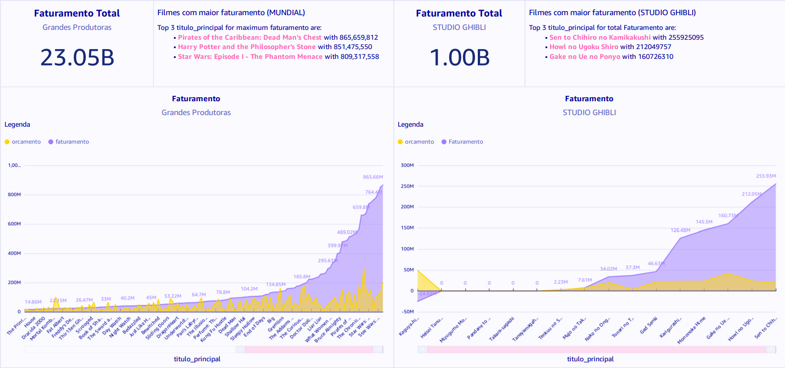
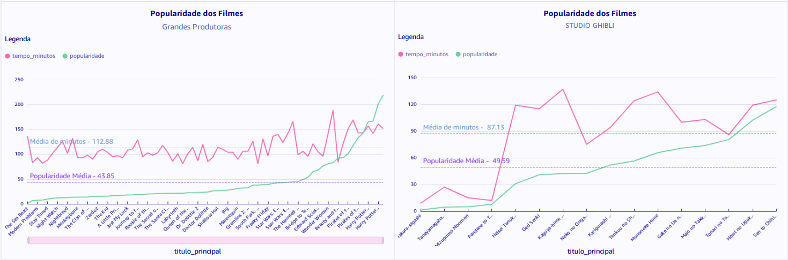
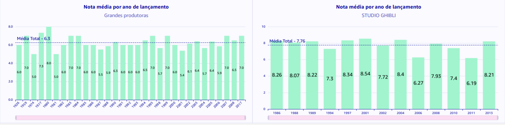

Diretório Sprint 10
===================

## DashBoard
O seguinte dashboard possui por finalidade apresentar um comparativo dos dados dos filmes de grandes produtoras conhecidas com os dados dos filmes de fantasia do Studio Ghibli, uma produtora japonesa que aborda em suas obras diversos temas e conceitos da cultura e folclore japonês e, mesmo assim, conseguiu cativar o mundo todo com a qualidade e enredo de suas lindas produções!!!

## Datalhando DashBoard...

#### Apresentação inicial sobre o StudioGhibli: O que produz, caractertísticas, fundação, etc.

#### Comparação de Faturamento dos filmes de grandes produtoras Vs Studio Ghibli

#### Popularidade dos filmes em relação às suas durações

#### Nota média dos filmes por ano de lançamento

## Certificado
