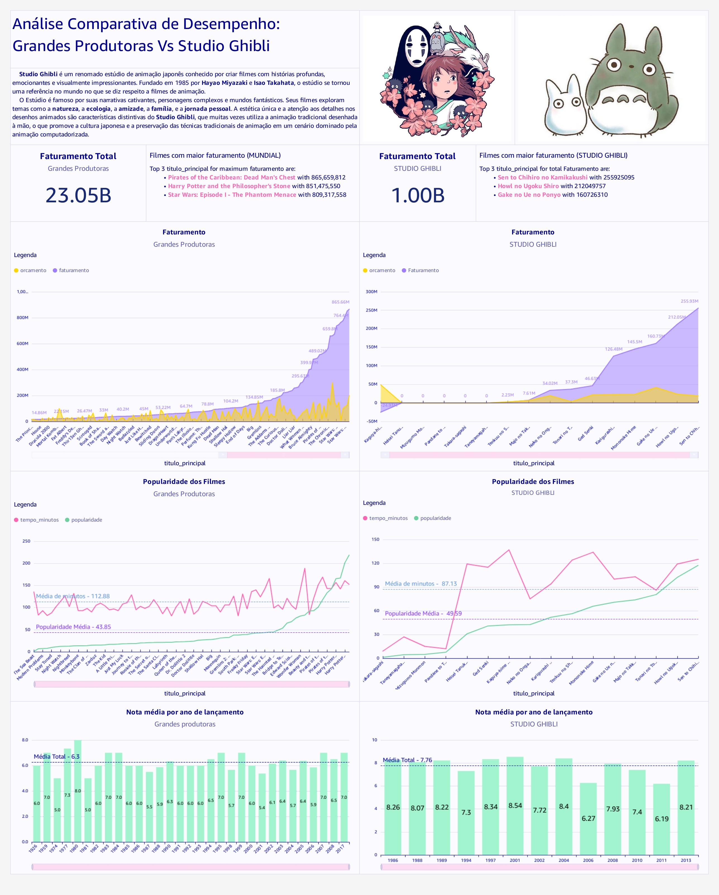
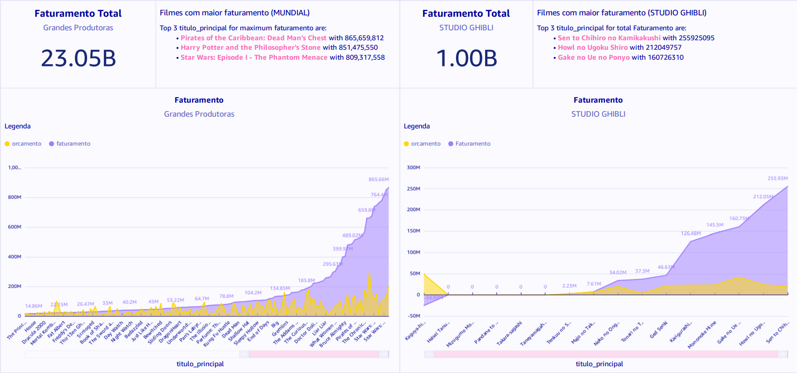
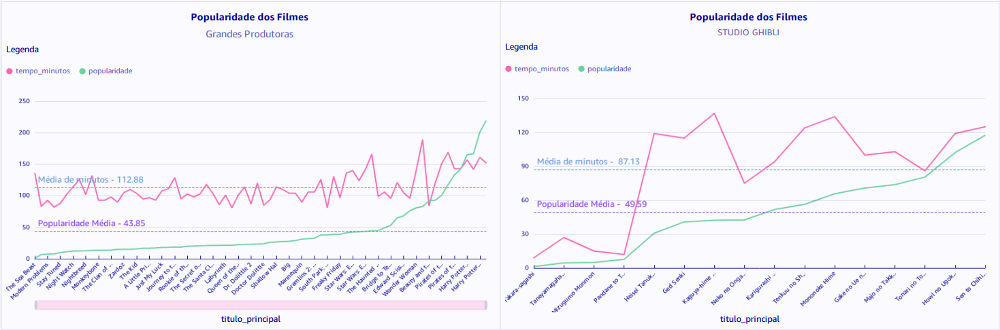

Diretório Sprint 10
===================

## DashBoard
O seguinte dashboard possui por finalidade apresentar um comparativo dos dados dos filmes de grandes produtoras conhecidas com os dados dos filmes de fantasia do Studio Ghibli, uma produtora japonesa que aborda em suas obras diversos temas e conceitos da cultura e folclore japonês e, mesmo assim, conseguiu cativar o mundo todo com a qualidade e enredo de suas lindas produções!!!

### Detalhando DashBoard...

#### Apresentação inicial sobre o StudioGhibli: O que produz, caractertísticas, fundação, etc.

#### Comparação de Faturamento dos filmes de grandes produtoras Vs Studio Ghibli
O desempenho do Studio Ghibli é de ser considerado, visto que muitas de suas obras possuem faturamento igual ou superior a outras grandes produções, como "O quarteto fantástico" e "Cinderela". Claro, existem outras produções que superam e muito as obras como "Viagem de Chihiro" ou "Castelo Animado", mesmo assim o desempenho desta produtora é de ser considerado visto que seus filmes são muito culturais e fantasiosos, ou seja, não são produções criadas com vista para agradar tudo e todos.

#### Popularidade dos filmes em relação às suas durações
Existe uma constância na duração dos filmes num contexto geral. Normalmente as obras ficam entre 70 a 130 minutos, mas isso pode variar. As grandes produtoras mantém um padrão em sua duração, ou seja, isso não é de relevância para a popularidade.  
Quando observamos o gráfico referente ao Studio Ghibli, notamos que as produções menos populares são as que possuem menos tempo de tela, pois são curtas metragens, obras desenvolvidas e que não chegaram a se popularizar fora do japão. Quando mais aumentamos a popularidade, mais notamos a presença de produções conhecidas por grande parte do público, como "Meu amigo Totoro", "Viagem de Chihiro" e mais.  
Ou seja, talvez não seja de grande valia a produção de curtas, que não possuem boa popularidade nem bom desempenho financeiro.

#### Nota média dos filmes por ano de lançamento
Observamos uma certa regularidade dos dados quanto a nota média dos filmes por cada ano de lançamento, apenas temos algumas exceções, como 2008 e 2011 para as produções do Studio Ghibli, as quais foram época de lançamento de alguns dos curtas metragens.

#### O que aprendemos com os dados?
Mais do que uma análise comparando o desempenho do Studio Ghibli em relação a grandes produtoras, vemos que este estúdio conseguiu desempenhar muito bem no contexto geral. Suas obras se tornaram conhecidas e admiradas no mundo inteiro! A qualidade de sua animação, enredo e excelência estética proporcionaram o sucesso merecido de suas produções.

Além disso, o estúdio não alcançou tamanho sucesso produzindo obras genéricas que entrariam no gosto de todas as pessoas. Pelo contrário, suas obras são recheadas de aspectos culturas e folclóricos do Japão que chegam a até causar estranhesa para o público ocidental. Deste modo, ela conseguiu desempenhar extraordinariamente sem perder sua essência e sem abdicar das suas raízes.

O Studio Ghibli conseguiu algo extraordinário: Obter sucesso em um mercado cinematográfico generalista ae globaliazado mantando as suas características e raízes bem estruturadas, não mudando nada para agradar a todos os gostos. Assim, podemos também construir grandes projetos e trabalhos sem abdicar de nossas raízes, mas se esforçando e nunca desanimando!

#### "Sempre que alguém cria alguma coisa com todo o seu coração, é dada a criação uma alma."
Baron - “O Reino dos Gatos"

## Certificado
