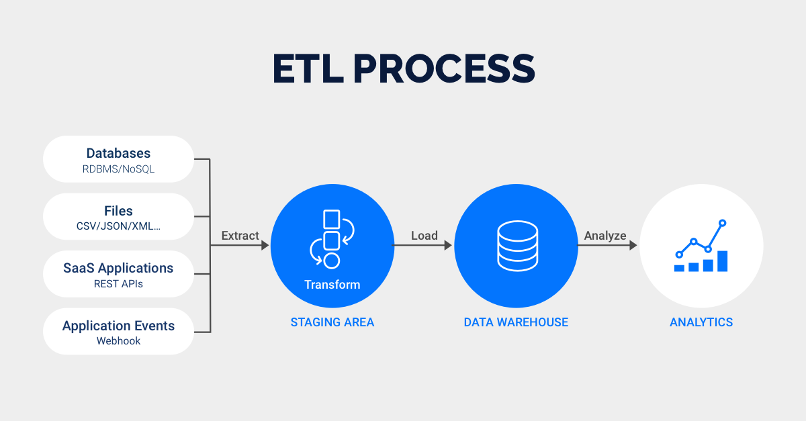

Diretório Big Data Fundamentos 3.0
==================================
### Diretório dedicado ao conteúdo do curso "Big Data Fundamentos" do Data Science Academy - Sprint 2;

## Resumo
### O que é Big Data?
É um conjunto de uma grande quantidade de dados complexos que não podem ser processados por bancos de dados ou aplicações de processamento convencionais;  
Mais do que somente manipular dados, estamos interessados em como extrair valor do Big Data, assim ele poderá ser útil. Afinal, de nada adianta ter uma grande quantidade de dados se não podemos retirar deles nenhuma informação relevante ou insight para a nossa operação;

O Big Data relaciona-se diretamente com o conceito dos 4 V's, os quais são indispensáveis para que exista Big Data.

### Os 4 V's do Big Data
1. Volume: Dados gerados em grandes quantidades;
2. Variedade: Formato dos dados -> PDF | JPG | IMG | CSV;
3. Velocidade: Como os dados são gerados, ou seja, gera-se dados a uma velociade gigantesca;
4. Veracidade: A confiabilidade dos dados;

A plena harmonia entre todos os 4 V's configura a existência de Big Data;

### Big Data X Ciência de Dados
É importante salientar que Big Data e Ciência de Dados **NÃO** são a mesma coisa.  
Quando nos referimos a Big Data, falamos sobre os dados em si, a matéria prima para a geração de valor.  
Já quando nos referimos a Ciência de Dados, estamos falando das técnicas empregadas para a análise de dados.  

Quando aplicamos a ciência de dados ao big data extraímos valor. Nesse situação temos o que é chamado de Big Data Analytics.

>### Casas de tamanhos de dados:
>KiloBytes -> MegaBytes -> GigaBytes -> TeraBytes -> PetaByte -> HexaByte -> ZettaBytes -> YottaBytes -> BrontoBytes -> GeoBytes...

### O "V" de *volume* no Big Data
É um conceito crítico em se falando de Big Data;  

Se uma empresa se preocupa unicamente com o modo que vão armazenar os dados mas não como vão acessá-los, ela certamente está **perdendo tempo**.  
Nesse aspecto a empresa precisa se perguntar:
* Como vamos armazenar grandes quantidades de dados?
* Como vamos acessar esses grandes conjuntos de dados?
* Precisamos mesmo armazenar todos os dados? (Existe um custo associado ao armazenamento);

Tudo isso está envolvido no V de volume, visto que essas resalvas são importantes de serem levantadas devido ao custo e ao trabalho existente no grande volume de dadosdo Big Data.

### Como devemos armazenar Big Data?
#### Regra Geral:
* Se os dados são **estruturados** ou podem ser estruturados antes do armazenamento, optamos por um **Data Warehouse**;
* Se os dados **NÃO** podem ser estruturados antes do armazenamento ou não são estruturados em si, optamos por um **Data Lake** ou um **Data Store**;

Dependendo do volume de daods, não haverá tempo o suficiente para primeiramente estruturar os dados. Você pode armazenar sem estruturar os dados em um DataLake e depois estruturá-los num Data Warehouse. Dependendo do cenário, também podemos fazer o inverso.

*Obs: DataWarehouse, DataLake e Data Store são **conceitos**. Eu posso guardar dados não estruturado em versões mais recentes do DataWareHouse, assim como posso armazenar dados já estruturados em um DataLake, não existe uma regra seguida a risca, apenas conceitos do que é mais viável.*

### SQL X NoSQL
Os **Bancos de Dados Relacionais** são bancos de dados estruturados e com schema (organização dos dados) bem definido.  
O schema deve ser definido e criado antes do armazenamento dos dados.  
Por exemplo, um datawarehouse geralmente é criado utilizando alguma tecnologia de banco relacional, como:
* Oracle
* TBM DB2
* Microsoft SQL Server
* MySQL
* PostgressQL
* SQLite

Nos **Bancos de Dados não Relacionais** os dados podem ser semi-estruturados ou ainda não estruturados. Além disso, outros tipos de relacionamento podem ocorrer, não somente por tabelas.  
Normalmente, não precisamos definir o schema antes do armazenamento ou ele é definido durante o processo de armazenamento.

#### *Para dar continuidade, vamos aprofundar os conceitos de Data WareHouse, Data Lake e Data Store*

### DataWareHouse
DataWareHouse é um sistema de armazenamento que conecta e harmoniza grandes quantidades de dados de muitas fontes diferentes.  
Que tipos de fontes?? **Dos mais variados tipos!**

Tem como objetivo alimentar a inteligência dos negócios, relatórios e análises e oferecer suporte aos requisitos de negócio para que as empresas possam transformar seus dados em insights e, principalmente, em **valor!**

O DataWareHouse armazena dados atuais e históricos em um único lugar e atuam como a única fonte confiável de informações.  
Os dados fluem de um DW por meio de sistemas transacionais, como **ERP** e **CRM**.

Como já mencionado anteriormente, o schema deve ser elaborado e definido antes do processo de armazenamento de dados em se tratando de um DataWareHouse.

Algumas pessoas aproveitam a análise de dados integgrada e a tecnologia de banco de dados in-memory para fornecer acesso em tempo real a dados confiáveis e impulsionar a tomada de decisões.

Sem o **DW** é muito difícil combinar dados de fontes heterogêneas, garantir que eles estejam no formato correto e ter uma boa visão com base neles.

#### Benefícios do DataWareHouse
* **Melhor análise dos negócios:** Os tomadores de decisão agora possuem acesso a uma gama de variados dados. Deste modo, não precisam trabalhar com informações incompletas;
* **Consultas mais rápidas:** Podemos acessar essa grande massa de dados com apenas alguns passos, apenas com um pouco de ajuda ou até mesmo nenhuma ajuda da área de T.I;
* **Melhoria da qualidade dos dados:** Os dados passam antecipadamente por um processo de limpeza, garantindo assim a transformação em um formato consistente para a tomada de decisão;
* **Visão histórica:** Ao armazenarmos dados históricos ricos, permitimos que os tomadores de decisões aprendam com tendências e desafios pessados, elaborem insights valiosos e façam ações preditivas;

### DataLakes
Também é um sistema de armazenamento. Porém, diferentemente de um DW, é usado geralmente para armazenar dados brutos, ou seja, não estruturados. Entretanto, podemos armazenar tanto dados estruturados quanto não estruturados, afinal, tanto DW quanto um DL são **conceitos**.  
Assim, quando o processo de estruturação for necessário, o analista pode fazer a limpeza dos dados necessários.  

Geralmente uma empresa pede tanto um datawarehouse quanto um datalake pois eles atendem a diferentes necessidades e casos de uso (**Ambos são importantes!**).

O schema não é definido quando os dados são capturados. Você pode armazenar todos os dados em formato bruto rapidamente.

Existe, porém, um desafio para as empresas que implementam os DataLakes: Os dados brutos são armazenados sem nenhum tipo de supervisão de conteúdo. Eles também precisam de mecanismos que irão catalogar e proteger os dados.

***Dica:** Podemos importar dados do DW para o Datalake e vice versa*

#### Benefícios do DataLake:
* **Armazenamento em formato bruto:** Não precisamos limpar e transformar os dados antes do armazenamento, podemos armazená-los em seu formato original, ou seja, bruto;
* **Importação de qualquer quantidade de dados em tempo real:** Os dados são coletados e inserios em seu formato original. Assim, permitimos a dimensionalização dos dados, o que economiza tempo de definição e de estruturação antecipada;
* **Repositório central para todos os dados da empresa:** Os mais variados setores e organizações da empresa conseguem acessar os dados com a sua ferramenta analítica específica, seja um engenheiro de machine learning ou um cientista de dados;
* **Sem necessidade de movimentação dos dados:** As análises podem ser feitas sem a necessidade de mover os dados para um sistema separador;

### DataStores
Repositórios feitos para armazenar e gerenciar de forma persistente coleções de dados que incluem dados estruturados e tipos de armazenamento variado, como documentos, dados no formado chave-flor, etc...

Ele permite que sejam armazenados dados variados e específicos para uma situação. Assim, já armazenamos dados praticamente prontos para serem usados.

#### Benefícios do DataStore
* **Armazenamento de variados tipos de dados:** Armazena diversos tipos de dados, até os que não se encaixam em outros repositórios de armazenamento
* **Flexibilidade:** Armazenamento de dados aderente às necessidades da aplicação final;
* **Suporte a dados semi-estruturados:** Possibilidade de armazernar dados que já possuem uma estruturação prévia, mas são necessários em seu formato original;
* **Custo total menor:** Em se tratando de ser uma ferramenta mais simples para o armazenamento de dados, seu custo também é menor;

### Sistemas Híbridos de Armazemanto
Montagem de novas arquiteturas e de implementação.  
Quanto maior for o avanço do Big Data, mais sistemas distribuídos deverão surgir, sejam eles locais ou em nuvem (DataHub).  
Sistemas Híbridos agem com mais uma ferramento para armazenamento de dados, ou seja, utilizam tanto DW quanto DataLakes ou DataStores, não somente um.

### Armazenamento e Processamentos Paralelos
#### O que é um cluster de computadores?
É um conjunto de servidores unidos em um mesmo propósito/serviço.  
Para que possamos aumentar a capacidade de nosso cluster, devemos adicionar mais máquinas ao mesmo. Isto se dá o nome de **Escalabilidade Horizontal**.  
Também podemos melhorar os recursos ou peças de computadores que já fazem parte de nosso cluster. É o que chamamos de **Escalabilidade Vertical**.

#### O que é armazenamento paralelo?
Distribuir o armazenamento de dados através de diversos servidores, o que permite aumentar de forma considerável a capacidade de armazenamento usando hardware de baixo custo.

#### Softwares para armazenamento paralelo
Para que possamos operar um armazenamento paralelo, precisamos de um sistema de arquivos distribuídos, - o software que faz a comunicação entre usuário e hardware - como exemplo temos:
* Apache Hadoop HDFS: Nele, os arquivos são salvos em mais de um computador. Nesse caso, caso algum computador for perdido, o arquivo ainda está salvo em outras máquinas, ou seja, não haverá perda de arquivos.  
    Responsável pela gestão de custer de computadores, definindo como os arquivos serão distribuídos através do cluster.  
    Por meio dele podemos criar um DataLake associado a um cluster de computadores permitindo, assim, o armazenamento de um grande volume de dados com o hardware commodity.

#### Processamento Paralelo no Big Data
Como vamos processar os dados que estão distribuídos em diversos computadores?  
No processamento paralelo, o objetivo é dividir uma tarefa em várias subtarefas e executá-los em paralelo.  
Temos algumas ferramentas de framework que nos ajudam nessa tarefa:
* Apache Hadoop MapReduce;
* Apache Spark;

Ao usarmos um framework de processamento paralelo, as subtarefas são levadas para o processador da máquina do cluster onde os dados estão armazenados, aumentando assim a velocidade de processamento de grandes volumes de dados.

#### Arquitetura de armazenamento e Processamento Paralelo
* #### MapReduceLayer  
    É um componente do apache Hadoop que roda sobre o HDFS.  
    Framework usado para processar dados em um ambiente distribuído.
* #### HDFS Layer
    Serviço usado para o armazenamento de dados dentro das máquinas do cluster. Está sempre rodando em cada máquina.

**O processamento paralelo é de demasiada importância para a geração de valor dentro de um projeto.**

#### Soluções de armazenamento e processamento paralelo
* Apache Hadoop;
* CloudEra: Empresa especializada em implementar funções por meio do próprio Apache Hadoop;
* Azure: Implementação de um ambiente para comportar grandes volumes de dados com diversas ferramentas;
* DataBricks: Implementação de LakeHouses;

### Cloud Computing
Devido ao grande avanço das tecnologias e ao aumento excessivo de dados gerados diariamente, o Big Data implementado localmente nas empresas está deixando de ser completamente viável. Assim, faz-se necessário a utilização de *aplicações em nuvem* para comportar essa massa gigantesca de novos dados!

#### **O que é Cloud Computing?**
É uma ferramenta que dá acesso a um servidor na internet oferecido por um provedor.
**Obs:** Paga-se somente pelo acesso;

Em outras palavras, é a entrega de serviços de computação pela internet para oferecer recursos mais flexíveis, inovações e economia em escala **(+ barato)**.

A cloud expandiu o limite físico do Big Data, pois anteriormente a empresa precisaria ter preocupação em sempre expandir sua capacidade de armazenamento comprando mais e mais máquinas.  
Com o advento do Cloud Computing, isso já não se torna mais necessário.

#### **Principais provedores em nuvem**
Grandes empresas estão investindo cada vez masi em Cloud Computing e Big Data pois há cada vez mais procura por esses serviços, além da volumosa quantidade de dados existente que pode gerar valor para a empresa. Dentre algumas delas temos:
* Amazon Web Services;
* Microsoft Azure;
* Google Cloud Plataform;
* IBM Cloud;
* Oracle Cloud;
------------------------
### MLOPs e DataOPs
Antes de adentrar nos conceitos de MLOPs e DataOPs, precisamos entender dois outros conceitos anteriores:
#### O que é Machine Learning?
É uma subárea da ciência da computação e da I.A que foca no uso de algoritmos e dados para imitar a forma como os humanos aprendem, melhorando gradativamente a sua precisão.  
O algoritmo aprende cada vez mais com base nos dados que lhe são fornecidos, sendo capaz de realizar previsões, criar insights valiosos, determinar ações preditivas, etc...

#### O que é PipeLine de Dados?
É todo o processo, o mapeamento das atividades para que você saia de uma ponta a outra em machine learning. Ou seja, é o fluxo de máquina, desde o início até termos a máquina aperfeiçoada com os dados fornecidos.

#### **MLOPs**
A cargo do engenheiro de Machine Learning;  
*Em sua essência, é **puro** desenvolvimento!*
* Aumenta a qualidade;
* Simplifica o processo de gerenciamento;

É um conjunto de práticas para a colaboração e comunicação entre o cientista de dados e os outros profissionais de operações.  
O MLOPs visa unificar o desenvolvimento de sistemas com a implantação destes sistemas para padronizar e agilizar a entrega contínua de modelos com alto desempenho em produção.

#### DevOPs
É uma abordagem para o desenvolvimento de software que acelera o ciclo de vida da construção usando automação. Implantação **contínua** de software.
* Reduz o tempo de implantação;
* Diminui o tempo de lançamento no mercado;
* Minimiza defeitos;
* Diminui o tempo necessário para resolver problemas;

#### **O que é DataOPs?**
É uma linha de produção para a criação de análises cuja matéria prima são os dados.  
Em outras palavras, é uma metodologia ágil e orientada a processos para desenvolver e entregar análises.  

Agiliza o design, o desenvolvimento e a manutenção de aplicativos com base em dados e análise de dados. Melhora o gerenciamento de dados.

#### Big Data X Small Data
Num Mundo totalmente conectado e que gera milhões de informações, existem projetos e desenvolvimentos que, ao invés de trabalhar com todos os dados disponíveis, conseguem ser realizados com a quantidade mínima de dados necessários para a compreensão humana. Este é o Small Data.

Em alguns cenários, poucos dados que geram valor já são necessários para o projeto. Assim, não precisamos trabalhar com Big Data a todo tempo, mas claro que Big Data não deixará de ser usado. Pelo contrário, é uma tendência que continua se espandindo a cada momento!

### Dados como Serviço (Data as a Service)
É uma estratégia de gerenciamento de dados que visa alavancar os dados como um ativo de negócios para maior agilidade no processo de análise.

Ela oferece uma forma para gerenciar os dados que são gerados diariamente pela empresa. Oferece os dados corretos para que a empresa possa gerar por meio deles, valor.

#### Arquitetura DaaS
Se concentra no provisionamento de dados de uma variedade de fontes sob demanda por meio do uso de API's, também:
* Simplifica o acesso aos dados;
* Oferece um conjunto de dados já tratados ou fluxos de dados a serem consumidos;

#### Principais benefícios de DaaS
* Monetização dos dados;
* Redução dos custos;
* Caminho mais rápido para invovação;
* Agilidade no processo de decisão baseado em dados;
* Menor risco no uso de dados;
* Criação de uma cultura Data-Driven: A tomada de decisões agora não se respalda mais da experiência ou expertize de gerentes ou funcionários, toda a tomada de decisões é baseada nos dados;

#### Arquiteturas modernas de Big Data
- #### Data LakeHouse
    Nova arquitetura de dados que combina a flexibilidade, economia e escala dos DataLakes com o gerenciamento de dados e transações ACID dos DW's. Assim, ele permite Business Inteligence e Machine Learning em todos os dados armazenados em um único repositório **(prático)**.
- #### Data Mesh
    Arquitetura de plataforma de dados que abrange a onipresença dos dados da empresa, permitindo um design orientado ao domínio e de autoatendimento.  
    **Obs:** É uma arquitetura de dados completamente descentralizada;  

    Os Data Mesh's buscam solucionar três problemas:
    1. Falta de propriedade;
    2. Falta de qualidade;
    3. Escalonamento organizacional;

    Ele trata os dados como se fossem um produto e sua infraestrutura de dados como plataforma. Assim, evita-se a duplicação de esforços para uma tarefa.

    Além disso, o Data Mesh ainda desafia o pré-conceito de que todos os dados que forem utilizados para o trabalho devem ser centralizados.

    O data mesh marca uma mudança de paradigma arquitetônico e organizacional em como gerenciamos Big Data.  
    O paradigma é baseado em quatro princípios:
    1. Descentralização orientada ao domínio da propriedade e arquitetura de dados;
    2. Dados orientados ao domínio servidos como um produto;
    3. Infraestrutura de dados de alto atendimento como uma plataforma para habilitar equipes de dados autônomos e orientados para o domínio;
    4. Governança federada para permitir ecossistemas e interoperabilidade;
   -------------------------------

### ETL -> Extração, Transformação e Carga de dados
Os dados não "nascem" já prontos para serem utilizados, sejam eles estruturados, semi-estruturados ou não estruturados.  
É necessário que eles passem primeiramente por um processo de extração, um nível de limpeza e sejam carregados para um outro local, para aí sim serem utilizados. Este gerenciamento dos dados é a **ETL**.

#### ETL X ELT
A ELT extrai os dados e os envia diretamente a uma fonte de armazenamento, como um DataLake. Nele, não precisamos transformar os dados antes de carregar. Eu transformo conforme a necessidade do meu projeto.  
Além disso, nele:
    * Deixamos o DW pronto para o usuário;
    * Conseguimos armazenar todos os dados;
    * Não se formam gargalos;

#### Principais soluções ETL e ELT do mercado
* Oracle Data Integrator;
* Pentaho;
* Apache Spark;
* Apache nifi;
* Azure Data Factory;
* AWS Glue: Prático, não possui servidor e tem uma interface fácil cuja configuração dura somente alguns minutos;
* Amazon Athena;
* Power Center;
* Apache Airflow;

### O que é Big Data Analytics?
O Big Data por si só não é capaz de gerar nenhum valor, pois são somente um grande volume de diversos dados distintos. É necessário que se aplique técnicas de análise. Deste modo, gera-se utilizade e valor para essa grande massa de dados.

Aplicamos a análise de dados no Big Data para gerar valor, este é o Big Data Analytics.

### Como as empresas estão utilizando o Big Data?
O Big Data pode ser útil para a grande maioria dos setores, visto que eles se beneficiam de insights e tomadas de decisões para alavancar sua operação.  
Dentre alguns setores temos:
* Manufatura: Uso de sensores IoT para captar dados e gerar informações valiosas;
* Finanças;
* Saúde: Prontuário eletrônico | Segmentação de imagens médicas com deep learning;
* Varejo: Dados que geram valor -> Interesse dos clientes, público-alvo, produtos muito procurados, etc...

### Como iniciar um projeto em Big Data?
- ### Os 4 passos gerais para iniciar um projeto em Big Data:
    #### Definição do Business Care
    Definição certeira dos objetivos a serem alcançados; Como será desenvolvido o projeto; Delimitar os problemas a serem resolvidos e as soluções já existentes na empresa.

    Diz qual é o seu objetivo para depois desenvolver o projeto e escolher as ferramentas a serem usadas.

    #### Planejamento do Projeto
    * Metas a serem mensuradas;
    * Identificar questões comerciais -> que o projeto deve gerar o resultado esperado;
    * Determminar e quantificar outros requisitos;
    * Definir como seria uma implementação de Big Data bem definida;
    * Definir uma linha de tempo com marcos bem definidos;

    #### Definição dos requisitos técnicos
    É uma aba do planejamento do projeto, nele devemos considerar:
    * O que é necessário para integrar o ambiente com Big Data?
    * Quais serão os resultados esperados e mudanças previstas?
    * Quais ferramentas deverão ser usadas?
    * Quail será o hardware utilizado?
    ...

    Na definição dos requisitos técnicos, precisamos:
    * Definir quais são os atributos de banco de dados que serão usados;
    * Definir quais serão as fontes de dados (Se eu tenho um objetivo bem definido, logo também sei em quais fontes de dados procurar);
    * Definir quais serão as ferramentas de análise a serem utilizadas;
    * Elencar quais serão as habilidades necessárias para trabalhar neste projeto: Para capitação de funcionários equipes, ou ainda contratar novas pessoas já capacitadas;
    * Definir qual será o tipo de arquitetura usada no projeto;
    * Definir as ferramentas que serão usadas para visualização de gráficos;

    #### **Criação de um "Total Business Value Assessment"**
    No TBVA, precisamos levar em conta alguns aspectos para ver se realmente o projeto que estamos planejando nos dará o retorno esperado (valor). Ou seja, precisamos validar se não perderemos o nosso tempo nos dedicando ao projeto planejado.  
    Dentre os aspectos temos:
    * **Time to business:** Quanto tempo para que o resultado gere resultado (geralmente 3 anos).
    * **Facilidade de uso:** O quão fácil é a usabilidade do projeto para o cliente;
    * **Escalabilidade:** Se durante o projeto percebermos que o dimensionamento não foi o ideal, devemos aumentar o ambiente. Acima disso, precisamos ver a escalabilidade do projeto para que a situação citada anteriormente não ocorra;
    * **Padrões técnicos:** Big Data quase não possui padrões, a empresa precisa criar seus próprios;
    * **Maturidade para dados:** A maturidade da empresa para desenvolver e trabalhar com dados deve ser levadad em consideração na criação ed um projeto;
    * **Fase de manutenção e suporte:** Você tem pessoas capacitadas para esse ambiente? É importante que, além de capacitar os desenvolvedores, realizar o mesmo em quem cuidará da manutenção e suporte ao projeto. Isso é ***essencial***.

## Certificado 

