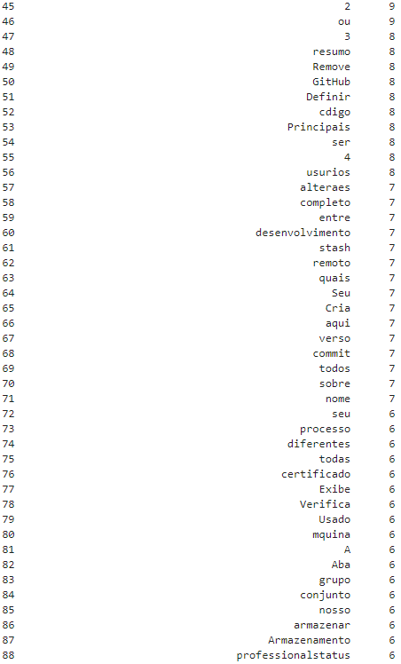

Diretório Exercícios Sprint 7
=============================
Diretório dedicado para o armazenamento das prints referentes aos exercícios c/ Spark e Pandas

## Spark (contagem de palavras)
A contagem de palavras foi feita com o arquivo readme da última sprint (sprint 6), todos os commits relacionados à sprint 7 são adicionados e enviados ao github (git push) de domingo p/ segunda feira.
### Imagem Baixada:

### Docker Container Funcionando

### Pyspark Funcionando

### Jupyter Funcionando

### Resultado usando PySpark

A contagem feita no pySpark separou todas as palavras em tuplas, com a palavra e sua respectiva contagem. Porém, é pouco intuitivo e bem difícil de se analisar.

### Resultado usando Spark-Shell

### Resultado usando Jupyter
Os códigos feitos em .ipynb estão na pasta [Tarefa-Spark](/Sprint_7/Exercícios/Tarefa-Spark/)

#### Código sem Pandas c/ resultado

#### Código c/ Pandas

#### Resultado c/ Pandas

E assim por diante, no total foram 1470 palavras contadas:
