Diretório Lab Glue
==================

## Imagens:

### Arquivo feito:
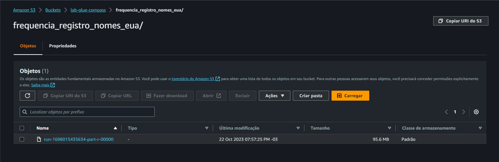

### Crawler executado:
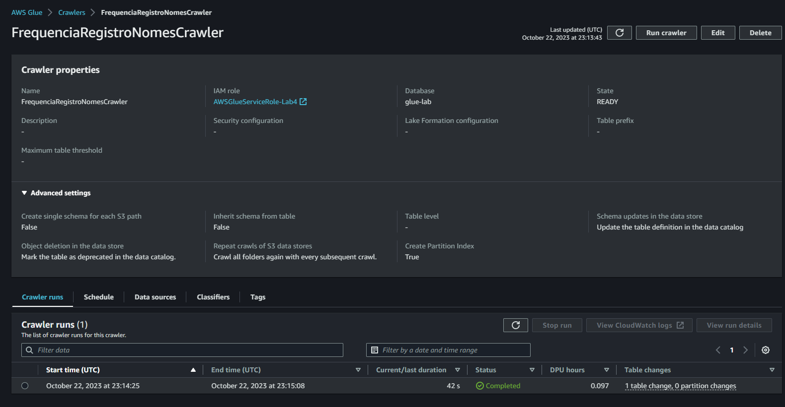

### Crawler create:
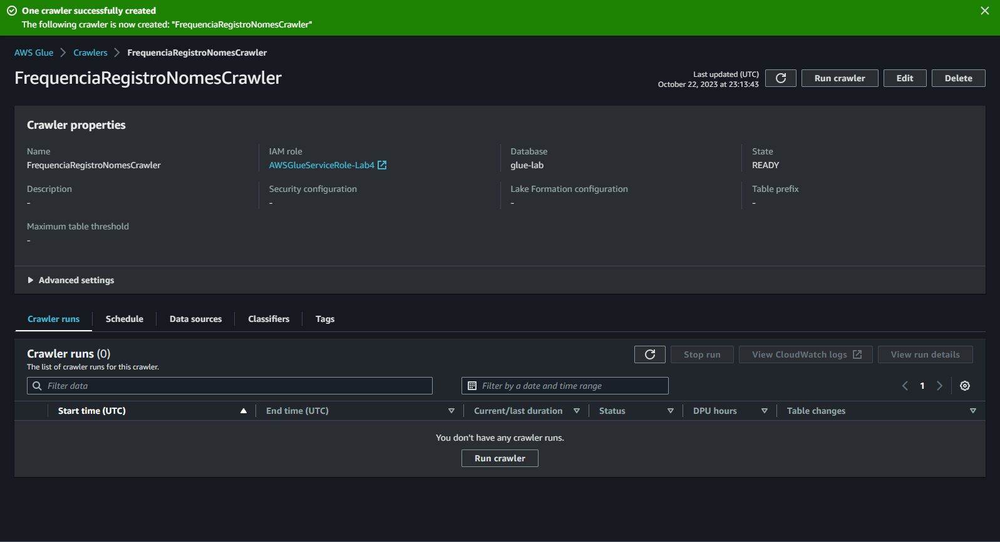

### Table criada:
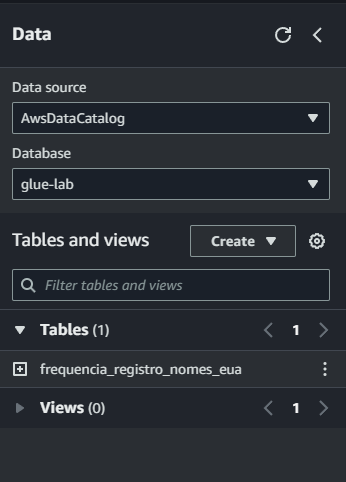

### Job final feito:
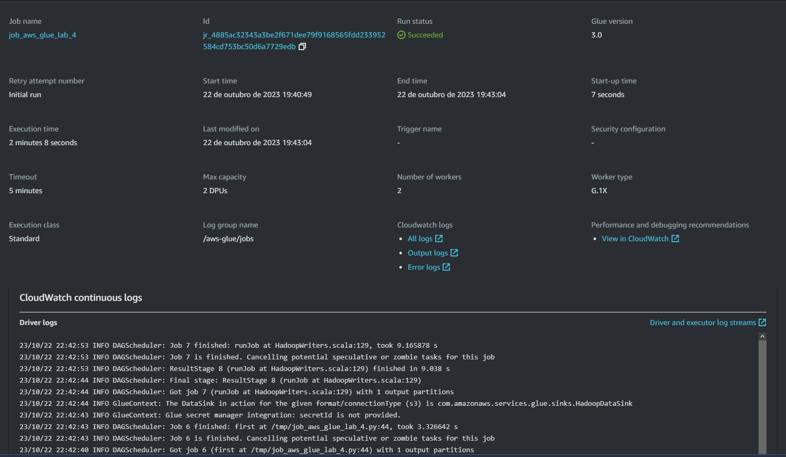

### Saidas
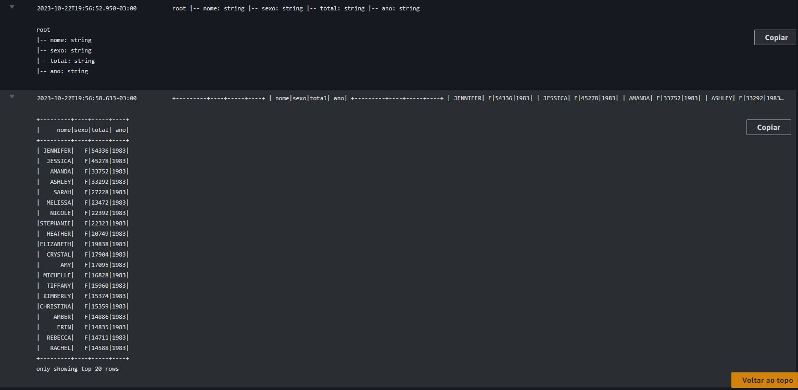

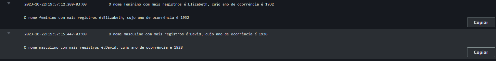
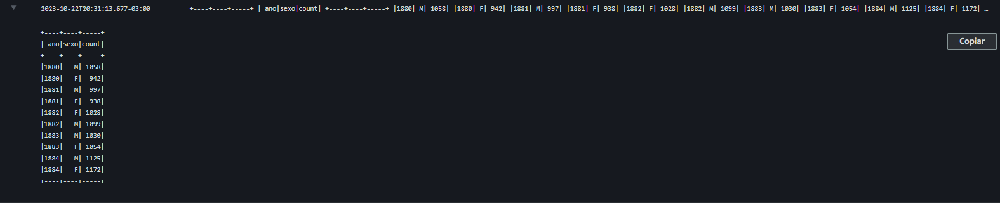
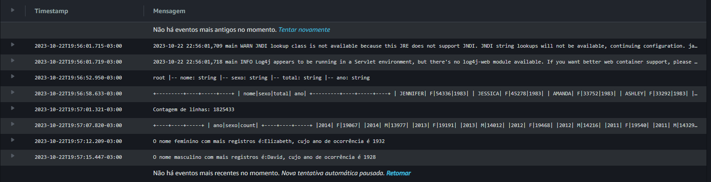

### tabela criada Glue
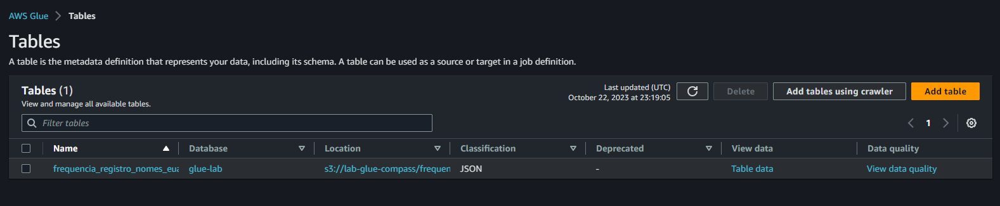
### Tabela criada athena
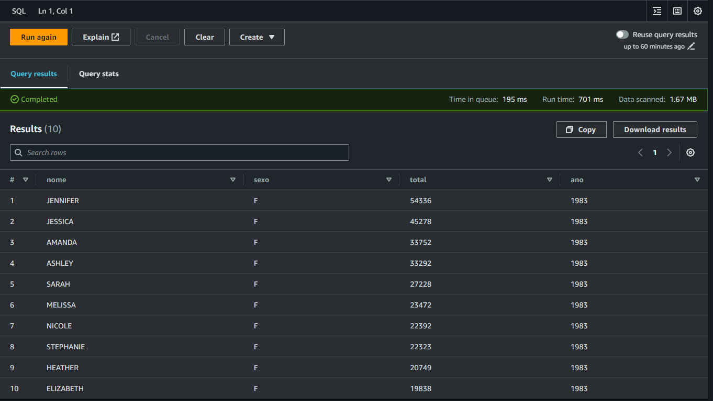