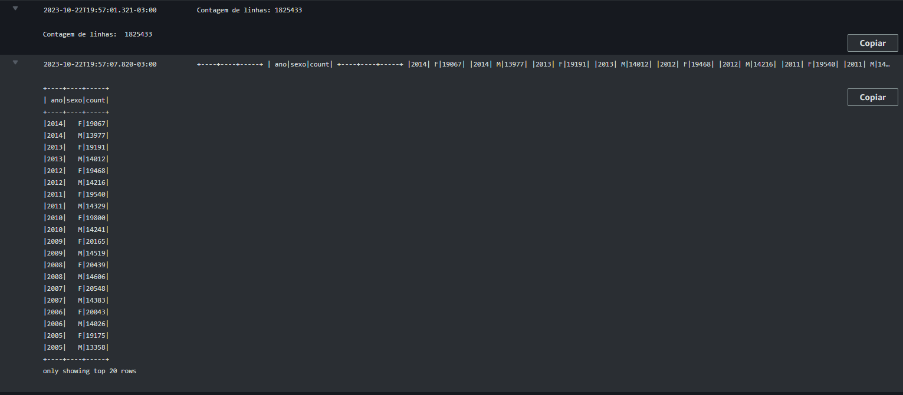

Diretório Lab Glue
==================

## Imagens:

### Arquivo feito:

### Crawler executado:

### Crawler create:

### Table criada:

### Job final feito:

### Saidas

### tabela criada Glue

### Tabela criada athena
