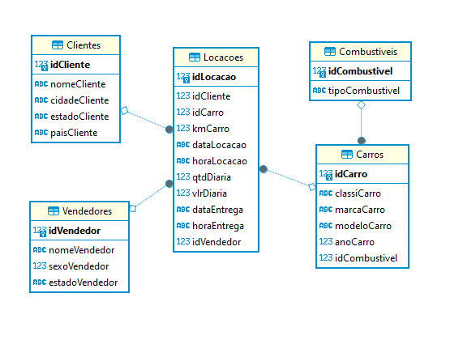

Diretório Modelagem de Dados
=============================

Para a criação dos diagramas foi utilizado o software DBeaver.a

## Tarefa 1: Modelagem Relacional

Nesta atividade foi normalizado a tabela tb_locacao, dividindo os dados de uma única tabela para tabelas diferentes que possuem cada uma as suas devidas informações.

## Tarefa 2: Modelagem Dimensional

Nesta atividade passou-se o modelo relacional para o modelo dimensional, com a criação das dimensões de cada dado juntamente com a tabela **fato**, que relaciona-se com as dimensões.

